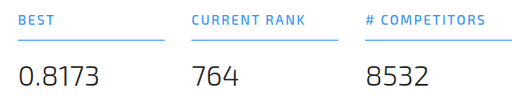

# Imaginación para un título

Vamos a intentar resolver el siguiente problema de clasificación por medio de un flujo de trabajo que nos permita ser lo más prolijo y eficiente posible. 

El problema se encuentra [aquí](https://www.drivendata.org/competitions/7/pump-it-up-data-mining-the-water-table/page/25/) y es parte de una competencia de [DataDriven](https://www.drivendata.org/). 
Nuestro objetivo es el siguiente: 

>
> Su objetivo es predecir la condición operativa de un punto de agua para cada registro en el conjunto de datos.
>

Vamos a utilizar algunas bibliotecas de apoyo, pero las principales serán: 
- *[cookiecutter](https://github.com/drivendata/cookiecutter-data-science)* para un template de Datascience (solo el template de carpetas)
- *sklearn* para muchas cosas ;) : pipelines sobre todo
- *category_encoders* para codificar con OrdinalEncoder nuestras features categóricas
- Modelos: RandomForest, LightGBM, XGBoost, Catboost

_________________

### 1. Analizando el Dataset
El análisis general se puede encontrar en la página de la competencia [aquí](https://www.drivendata.org/competitions/7/pump-it-up-data-mining-the-water-table/page/25/), lo que intentamos en esta parte es ver si podemos descartar algunas columnas que quizás no nos genere información relevante  en el modelo.

En términos generales, no tenemos tantas features númericas (9 para ser específicos) y tampoco se encuentran relacionadas de manera lineal, por eso vamos a enfocarnos en las features categóricas y ver cuales podríamos descartar...

¿Como podríamos realizar esta tarea? En la [descripción de las features](https://www.drivendata.org/competitions/7/pump-it-up-data-mining-the-water-table/page/25/#features_list), hay varias que parecen "contener la misma información", por ejemplo: 

- 'payment', 'payment_type'
- 'water_quality', 'quality_group'
- 'region', 'region_code'
- 'scheme_management', 'scheme_name'
- 'extraction_type', 'extraction_type_group'
- 'extraction_type_class', 'extraction_type_group'
- 'extraction_type_class', 'extraction_type'
- 'management', 'management_group'
- 'quantity', 'quantity_group'
- 'source', 'source_type'
- 'waterpoint_type', 'waterpoint_type_group'

Cuando digo "misma información", me refiero a que pueden contener información más específica pero no más relevante de la que está ofreciendo, recordar que estamos intentando reducir un poco la cantidad de features. 

Vamos a utilizar una técnica derivada de "feature_interaction". En esta técnica se concatenan dos o más columnas en una sola, para más [información dirigirse al curso de kaggle](https://www.kaggle.com/matleonard/feature-generation#Interactions).
Entonces por ejemplo, para el siguiente caso: 

| tipo  | lugar  |  interaction |
|---|---|---|
| agua  | lago  | agua_lago  |
| agua  | rio  | agua_laguna  |
| agua  | mar  | agua_mar  |
| tierra  | llanura  | tierra_llanura  |
| tierra  | montaña  | tierra_montaña  |
| tierra  | meseta  | tierra_meseta  |

Si observamos bien... en este caso llanura siempre va a estar relacionada con tierra, al igual que montaña y meseta; lo mismo ocurre con lago, rio y mar. Esto nos da como resultado una feature que va a tener la misma cardinalidad que la feature lugar. Lo que vamos a hacer es descartar la columna "tipo". 

> Nota: hay otras maneras de descartar features categóricas como puede ser utilizar SelectKBest con chi-squared test, pero me pareció algo sencillo de realizar sobretodo para mantener features "representativas". 

Para ejemplificar con nuestro dataset, podemos ver que *payment* y *payment_type* tienen nombres distintos, pero terminan representando lo mismo. Concatenamos ambas columnas por medio de un "_": 
```
'pay annually_annually', 
'never pay_never pay', 
'pay per bucket_per bucket', 
'unknown_unknown', 
'pay when scheme fails_on failure', 
'other_other', 
'pay monthly_monthly'
```
realizamos este análisis de cada una de las columnas de más arriba y decidimos descartar: 
 ```
'payment_type', 'extraction_type_group', 'management_group', 'quantity_group', 'source_type', 'waterpoint_type_group'
 ```
ya que los mismos datos que poseen estas columnas pueden obtenerse por medio de otras (o son grupos que los contienen). 
 
### 2. Lean Thinking? Build your first system quickly, then iterate.

Siguiendo consejos entrelazados, Andrew Ng siempre nos recomendó armar un sistema lo más rápido posible, e ir iterando midiendo nuestro error con alguna métrica (o evaluando nuestro modelo). Si relacionamos los conceptos con la metodología Lean, no difieren en tanto: Build-Measure-Learn. 
El concepto más general es: 
- Construir un modelo lo más agil posible.
- Medir el error (o evaluar nuestra métrica) para saber como nos encontramos.
- Iterar: mejorar parámetros, conseguir más datos, hacer feature engineering, cambiar modelo...

¿Como vamos a conseguir esto? Continuaremos con los siguientes pasos: 
- Evaluar varios modelos sobre una métrica: en este caso vamos a evaluar algunos modelos
- Seleccionamos un modelo: el que mejor se adapta al problema
- Tuneamos los hiperparámetros
- Evaluamos en train/test split
- Subimos las predicciones
- Si es necesario, iteramos "pivotando" o "perseverando" en la solución. 
    - si pivotamos podríamos cambiar de modelo
    - si perserveramos podriamos modificar más hiperparámetros o realizar un nuevo feature engineering
    
Comencemos!

### 3. Automatización: Pipelines ayúdenme
En un flujo de ML, hay ciertos pasos que suelen ser repetitivos como una secuencia y deben aplicarse a todos los datos, como por ejemplo realizar selección de features o transformaciones de las mismas. Es decir, para realizar la predicción sobre un conjunto de datos nunca antes visto vamos a tener que aplicar todos los pasos de preprocesamiento para luego poder obtener una predicción de nuestro modelo.

Estos pasos suelen traer complicaciones a nuestro código ( más si usamos las jupyter notebooks ), nuestro código queda disperso por distintas celdas, y no sabemos en que pasos lo fuimos ejecutando. Podríamos hacer "backtracking" visual mirando el número de ejecución de las celdas, pero no deja de ser engorroso y muy propenso a errores. 

Entonces, vamos a utilizar sklearn-pipelines para realizar estos pasos!. A grandes rasgos, tenemos que conocer estas 3 clases: 
- sklearn.pipeline.Pipeline: es la clase que wrappea nuestro pipe
- sklearn.pipeline.FeatureUnion: esta clase nos permite concatenar varios pipes (ahora vemos un ejemplo)
- sklearn.preprocessing.FunctionTransformer: esta función nos permite generar un transformer para utilizar en un pipe

```
def preprocess_pipeline():
    return FeatureUnion(
                transformer_list = [
                    ('date_features', Pipeline([
                        ('selector', get_date_data),
                        ('transform', transform_date_data)
                    ])),
                    ('numeric_features', Pipeline([
                        ('selector', get_numeric_data),
                        ('imputer', SimpleImputer()),
                    ])),
                    ('text_features', Pipeline([
                        ('selector', get_text_data),
                        ('vectorizer', OrdinalEncoder())
                    ]))
                 ]
            )
```    
Como podemos observar, nuestro pipeline de preprocesamiento se divide en 3 pipes: procesamiento de fechas, procesamiento de features númericas y procesamiento de features categóricas. Utilizamos FunctionTransformer como un wrapper para la construcción de distintos transformers por tipo.

```
get_numeric_data = FunctionTransformer(lambda df: df[NUMERIC_COLUMNS])
get_text_data = FunctionTransformer(lambda df: df[TEXT_COLUMNS])
get_date_data = FunctionTransformer(lambda df: df[['date_recorded']])

transform_date_data = FunctionTransformer(lambda df: df.assign(
    date_recorded_day=df.date_recorded.dt.day,
    date_recorded_month=df.date_recorded.dt.month,
    date_recorded_year=df.date_recorded.dt.year
).drop('date_recorded', axis=1))
```

En un pipeline vamos a encadenar objetos "transformers" (poseen fit/transform) y el último objeto tiene que ser un estimador (poseen fit/predict).
Para las variables categóricas usamos un [OrdinalEncoder](https://contrib.scikit-learn.org/categorical-encoding/ordinal.html) de la librería *category_encoders*. Es un poco más potente que el LabelEncoder de sklearn: tiene manejo de labels desconocidos lo que nos permite utilizarlo en un split dataset de test entrenado en el conjunto de train. 

Luego tenemos un pipeline contenedor del preprocesamiento y el estimador: 
```
def get_pipeline_model(clf):
    return Pipeline([
        ('preprocess', preprocess_pipeline()), # method above
        ('clf', clf)
    ])
```

Este método nos va a permitir armar pipelines con distintos clasificadores.
    
### 4. Select a model at a glance
Para esto vamos a utilizar nuestra función para wrappear los estimadores y la función [cross_val_score](https://scikit-learn.org/stable/modules/generated/sklearn.model_selection.cross_val_score.html) de sklearn.
    
<script src="https://gist.github.com/JonathanLoscalzo/0a8263a2336bc772b18628fd56d72685.js"></script>
<!-- [gist](https://gist.github.com/JonathanLoscalzo/0a8263a2336bc772b18628fd56d72685) -->

Vamos a evaluar varios estimadores, asi encontrar el que retorna la mejor métrica. En este caso estamos evaluando *accuracy*, aunque ya sabemos que esto trae problemas para datasets desbalanceados. 

Si observamos... ¿por qué utilizamos el pipeline de preprocesamiento de esta manera?. 
Hay que tener en cuenta un concepto llamado [data leakage](https://www.kaggle.com/alexisbcook/data-leakage). Podemos decir de una manera simple, que tenemos que evitar que datos del target asi como también datos del split de test aparezcan en train. 
Si revisamos nuestro pipeline con las features númericas, hay un SimpleImputer, el cual utiliza la media para imputar valores faltantes. Si revisaramos todo el dataset, computamos la media, y luego hacemos un split de train/test estaríamos filtrando datos (la media) en todo el dataset de train, es decir solo deberíamos tomar la media de train!.

Cuando ejecutemos *cross_val_score*, vamos a separar el dataset en k partes y se entrenará el modelo en k-1 partes del mismo, evaluamos en la parte que separamos. Continuamos con el siguiente split, separando (hold out) una parte, y entrenando con las otras k-1 partes

Luego promediamos las k predicciones para cada split "nunca antes visto". Es decir, vamos a entrenar k modelos!


```
********** Start **********
XGBClassifier : 0.7336868686868687 +/- 0.0029033449613791182
Time spent :  0:00:26.835271
********** End **********

********** Start **********
LGBMClassifier : 0.7723063973063974 +/- 0.0009899791533999399
Time spent :  0:00:10.892493
********** End **********

********** Start **********
RandomForestClassifier : 0.8024242424242424 +/- 0.0021431445901952087
Time spent :  0:00:18.336419
********** End **********

********** Start **********
CatBoostClassifier : 0.7148653198653198 +/- 0.0023408544566768295
Time spent :  0:00:07.668704
********** End **********
``` 
    
Como podemos ver, el mejor modelo es RandomForest aunque el tiempo de entrenamiento fue casi el más lento. Lo elegimos para hacer el entrenamiento.
    
### 5. Tuning Selected model: GridSearch
Vamos a encontrar los mejores parámetros para nuestro clasificador RandomForest. Esta tarea puede llevar mucho tiempo, debido a que estamos entrenando muchas combinaciones de parámetros en el modelo. 
Utiliza la misma estrategia de cross_validation con 

Para saber cuanta combinaciones de modelos vamos a entrenar, podemos ejecutar el siguiente código: 

```
len(ParameterGrid(params_rf)) # 432!!!
```

A fines prácticos, mostramos la combinación de parámetros que utilizamos pero vamos a mostrar los que mejor evaluó nuestra búsqueda.
Evaluamos las siguientes métricas: accuracy y f1_score.

<script src="https://gist.github.com/JonathanLoscalzo/71a620a9f71547ba4ef05b32e841f3c7.js"></script>

La búsqueda nos retorna los siguientes hiperparámetros: 
```
({
    'clf__bootstrap': True,
    'clf__class_weight': None,
    'clf__max_features': 'auto',
    'clf__min_samples_leaf': 2,
    'clf__min_samples_split': 2,
    'clf__n_estimators': 300
}, # hyperparameters
    0.8035077139554753) # accuracy
```
 
Para ver un detalle de todos los entrenamientos y evaluaciones que realizó GridSearch podemos utilizar el siguiente comando (lo vemos bonito en las notebooks): 
``` pd.DataFrame(gs_rf.cv_results_) ```
    
### 6. Evaluate with hyperparameters
Algunas personas suelen promediar las respuestas del gridsearch o cross_validation, es decir, tienen N modelos entrenados según la cantidad de split groups que realizaron (parámetro ```cv```). 
Nosotros vamos a entrenar con el dataset (X_train, y_train), y luego evaluar en (X_test, y_test)
¿Cual sería el beneficio de usar el primer enfoque? 3 modelos con menos datos puede ser entrenado más rápido que uno solo modelo con todos los datos. 

```
X_train, X_test, y_train, y_test = train_test_split(
    X, y, 
    test_size=0.33, 
    stratify=y # stratify by target labels
)
```

Creamos una función que nos muestra las métricas que queremos evaluar, de esta manera podemos reutilizarla con otros modelos. La misma se encuentra aquí [print_metrics](https://github.com/JonathanLoscalzo/pump-it-up_data-mining-the-water/blob/master/pumpitup/notebooks/utils.py)

Como podemos observar, el modelo no tiene una buena predicción con la etiqueta 1, la cual corresponde a 'functional needs repair', las otras etiquetas tienen resultado aceptable. 
    
- 0: 'functional'
- 1: 'functional needs repair'
- 2: 'non functional'

```
********** Metrics for: Test **********
accuracy: 0.8068054280175492
    
********** Classification Report **********
      precision    recall  f1-score   support

0       0.90      0.80      0.85     12051
1       0.29      0.63      0.40       665
2       0.77      0.84      0.80      6886
```

La matriz de confusión nos muestra la misma información:  


Revisando las feature_importances de nuestro modelo podemos observar las 10 mas importantes: 


    quantity - The quantity of water
    longitude, latitude - GPS coordinate
    waterpoint_type - The kind of waterpoint
Tiene sentido que esas features sean importantes pero quizás, otras también lo sean y nuestro modelo no las detecta. Podríamos probar (en la siguiente iteración ;) ) otros modelos y ver que features tienden a ser más importantes.

Como podemos ver, nuestro modelo tiene un accuracy en 0.80 para los datos nunca antes vistos, y para los datos del entrenamiento (bias) tiene un accuracy  de 0.94. Si revisamos el classification-report y la matriz de confusión nos damos cuenta que nuestro modelo le cuesta generalizar en la clase 1, en cambio en las otras clases funciona bastante bien. 

### 7. Train with whole dataset! Final Model (for now...)  
Ahora, entrenamos nuestro modelo junto al pipeline con todo el dataset, y realizamos el submit para la competencia. 
```
rf_final = get_pipeline_model(RandomForestClassifier()).set_params(**rf_params,)
rf_final = rf_final.fit(X,y)
```
Hay que tener en cuenta que hicimos las predicciones con los targets encoded, asi que tenemos que hacer un inverse_transform para obtener los labels correspondientes. 

```
predictions = rf_final.predict(datatest)
predictions = y_transformer.inverse_transform(predictions)
now_str = datetime.now().strftime('%Y-%m-%d_%H-%M-%S')
pd.DataFrame(predictions, index=datatest.index, columns=['status_group']).to_csv(f'../data/results/results-rf-{now_str}.csv')
```
Como podemos ver, nuestra salida tiene un now_str que nos indica la fecha que lo utilizamos para identificar la misma.

Subimos el archivo y obtuvimos una buen resultado!



## Futuro
### Handling imbalanced datasets
Hay que tener en cuenta que nuestro dataset está bastante desbalanceado para el target *functional needs repair*.


Podríamos tomar alguna medida al respecto. 
ver: [imbalanced-learn](https://github.com/scikit-learn-contrib/imbalanced-learn)

### Scaling numeric data
Podríamos realizar algún tratamiento de estalamiento en los datos númericos. 
En este caso, RandomForest (y la mayoria de los algoritmos basados en arboles) utilizan otros coeficientes que no se ven afectados por el escalado (como kmeans, PCA, ...)

ver: [Decision-Tree](https://www.saedsayad.com/decision_tree.htm), [information-gain](https://en.wikipedia.org/wiki/Information_gain_in_decision_trees)

### More Speed? Parallelize Approach? Dask!
Podríamos intentar paralelizar en el caso de que la cantidad de información sea bastante grande. 
Hay librerías dedicadas, aunque podríamos seguir la guía de sklearn [aquí](https://scikit-learn.org/stable/developers/performance.html?highlight=joblib).

Hay varias herramientas conocidas para hacer paralelización en el mundo de Big Data. 
- Pyspark: posee algoritmos internos y otras features similares a sklearn. No es compatible el código con el nuestro (es decir, tenemos que reescribir gran parte)

- Dask: según su página *Dask is a flexible library for parallel computing in Python.*
Es muy interesante! tiene una interfaz semejante a las librerías ya conocidas: sklearn, pandas, pero se le agrega la sentencia ```compute()``` al final.
En el siguiente [link](https://ml.dask.org/index.html?highlight=random%20forest#parallelize-scikit-learn-directly) nos comentan como paralelizar sklearn directamente!

ver: [pyspark-mllib](https://spark.apache.org/docs/latest/ml-guide.html), [dask](https://docs.dask.org/en/latest/), [DAG](https://en.wikipedia.org/wiki/Directed_acyclic_graph)
### Ensemble models: mlextend
Podríamos ahora, entrenar otro modelo que sea más eficiente para detectar el target *functional needs repair*, y obtener un modelo "ensamble" de varios modelos. 
Hay varias técnicas para esto: EnsembleModels, StackingModels. 
La librería mlextend posee algunas herramientas que nos pueden ayudar en dichas tareas. 

ver: [mlextend](http://rasbt.github.io/mlxtend/)
### Feature Engineering
Podríamos utilizar un enfoque más avanzado de feature selection, feature transformation, etc.

ver: [tpot](https://github.com/EpistasisLab/tpot), [xverse](https://github.com/Sundar0989/XuniVerse), [category_encoders](http://contrib.scikit-learn.org/categorical-encoding/), [sklearn feature selection](https://scikit-learn.org/stable/modules/feature_selection.html)
