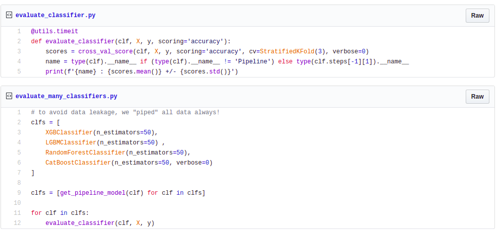

# How to solve a classification problem with a reusable pipeline workflow - 1
# Choosing between ML models using pipes for code reuse
While browsing on posts, we will able to find some *recipes* of how to start in the ML world, the popular *"Hello World!"*.
Usually, they involved next steps: Data Gathering, Data Preparation, Train your Model, Evaluate it, Improve... At the end, depending on the type of solution, if it is a competition, we will submit the predictions and if it is a Real World Problem, we will continue with the deployment step. 

Well, we say ourselves "Let's play with it" following the how-to steps. An hour later, we will end it up with big ball of mud, the well-known spaghetti code. Our *experiment* will finish with lack of reproducibility, error prone, nothing to be proud of.

Furthermore, there are many hidden steps in our flow, such as Model Selection & Hyperparameter tuning, which won't appear in the deployment model (they are also important)

*How to evolve our code to be ordered, reproducible, flexible (and other quality measures)?* We could get a modularized solution. *How to get it?* That will be solve by sklearn and its pipeline utilities. Think the whole pipe as a big module, made up by other tiny pipes. Each pipe would have its purpose, such as *feature selection*, *feature transformation*, *prediction* and so on.

> The better you code today, the easier you will understand in the future.

In this post, I will give an intuition of how to solve a classification problem by taking a reproducible and modular approach made up with sklearn and pipes.

### The Problem: *Pump it Up, Data Mining the Water Table*

We will build our approach with the problem which is being sponsored by [DataDriven](https://www.drivendata.org/). The challenge is to predict the operative condition (functional, non-functional, functional-need-repair) for each  water point of each record in the dataset. 

_______________

### 1. Analyzing the dataset
A more general data analysis could be found in the challenge site [here](https://www.drivendata.org/competitions/7/pump-it-up-data-mining-the-water-table/page/25/). In this section, we avoid repeating the previous investigation but it is a good practice to do it by ourselves to understand the data.

In general terms and as first approximation, we will drop some features that seem to have similar information.
In other words, we will reduce quantity of features to get a better model performance.

We will use a derived technique of *feature interaction* to show which columns has redundant information, if it exists, we will drop it. 
For example: 

| type | place | interaction |
| --- | --- | --- |
| water | lake | water_lake |
| water | river | water_river |
| water | sea | water_sea |
| land | plain | plain_land |
| land | mountain | mountain_land |
| land | plateau | plateau_land |

<!-- es earth? or land? -->

In the above example, *plain* will *interact* always with *land*, and so on. Therefore, the column *type* shows generalized information from *place* (which is a particular case). 
In this case, the column *interaction* shows same cardinality as place, so we may decide to drop *type*.

> Note: In tree based models, more cardinality will result in more splits, what that result in more complexity. In other iteration we could test if other techniques perform better. Anyway, other tricks to select or drop features exists such us *SelectKBest*, *SelectFromModel*, *WOE*, *IV*, and so on. I think this *craft* technique was easy to keep representative features and let the algorithm figure out these groups. 

To illustrate this technique with our dataset, we could see that *payment* and *payment_type* have different names but in the deep they are trying to represent the same. Thus, we concat the columns by '_' and the interaction result as: 
```
'pay annually_annually', 
'never pay_never pay', 
'pay per bucket_per bucket', 
'unknown_unknown', 
'pay when scheme fails_on failure', 
'other_other', 
'pay monthly_monthly'
```

We can see that the columns express same information but in other words.

Performing the same process above for the other columns, we drop the following: 

```
'payment_type', 'extraction_type_group', 'management_group', 'quantity_group', 'source_type', 'waterpoint_type_group'
 ```

> Remember that the explanation for these drops was that exists columns which we could infer from others.

### 2. Lean Thinking? Build your first system quickly, then iterate.

Following the advice from Andrew Ng, He always recommend to come up with a solution as soon as possible, measuring our error, evaluate our model and then iterate. This concept is also related to Lean-StartUp methodology with the lemma Build-Measure-Learn. In a main way, it is to apply the agile methodology.

The generalized concept is: 
- *Build a model* asap. 
- *Measure the error* to evaluate how is going on.
- *Iterate* to find better hyperparameters, gather more data, do feature engineering, change the model...

How can we do that? Now we will continue with next steps:
- Evaluate a few models
- Select a model, which adapt best to the problem.
- Tune hyperparameters
- Evaluate in train/test split (Hold out)
- Submit predictions
- If need be, iterate "pivoting" or "persevere"
    - If we pivot, we could select other model.
    - If we persevere, we could change hyperparameters or take in practice other feature engineering techniques...

<!-- Cross-validation is usually the preferred method because it gives your model the opportunity to train on multiple train-test splits. This gives you a better indication of how well your model will perform on unseen data. -->

### 3. Automate the workflow: Pipelines!
In a ML flow, some steps are often repetitive and them must apply on different stages, such as: feature selection or transformation. In other words, to predict over on unseen dataset, we must apply every preprocessing step (transformation) and then predict with our trained model.

These transformation steps usually brings *"bad smells"* (and more if we use jupyter notebooks): our code is sparsing over every cell, and we forget the real execution order. Our code is error prone and has low quality.

<!-- Instead of sparse our code, we try to build *modules*, and other *modules* built by them, we will build clean code. In order to achieve this, we decide to build it with sklearn and pipelines facilities: -->

If instead of sparse our code, we try to create modules, and also other modules made by them, we will be building clean code. In order to achieve this, we decide to create this modules with sklearn and its pipelines facilities.

- *sklearn.pipeline.Pipeline*: to compose pipes, we could also use *make_pipeline* method.
- *sklearn.pipeline.FeatureUnion*: to concat pipes.
- *sklearn.preprocessing.FunctionTransformer*: to create a transformer from our code and make our pipes more flexible.

FunctionTransformer is used to build columns selectors: 

```
get_numeric_data = FunctionTransformer(lambda df: df[NUMERIC_COLUMNS])
get_text_data = FunctionTransformer(lambda df: df[TEXT_COLUMNS])
get_date_data = FunctionTransformer(lambda df: df[['date_recorded']])

transform_date_data = FunctionTransformer(lambda df: df.assign(
    date_recorded_day=df.date_recorded.dt.day,
    date_recorded_month=df.date_recorded.dt.month,
    date_recorded_year=df.date_recorded.dt.year
).drop('date_recorded', axis=1))
```

Next code shows how to build a *preprocess pipeline* 

```
def preprocess_pipeline():
    return FeatureUnion(
                transformer_list = [
                    ('date_features', Pipeline([
                        ('selector', get_date_data),
                        ('transform', transform_date_data)
                    ])),
                    ('numeric_features', Pipeline([
                        ('selector', get_numeric_data),
                        ('imputer', SimpleImputer()),
                    ])),
                    ('text_features', Pipeline([
                        ('selector', get_text_data),
                        ('vectorizer', OrdinalEncoder())
                    ]))
                 ]
            )
```    
Our preprocess pipeline is splitted up in 3 more pipes: date, numeric and text preprocessing!!! It is easy to reproduce, to test and to build more pipes on top of it. 


In a common pipeline, we are going to concat "transformers" and last step will be an "estimator". So, in a reusable and generic way, a full pipeline could be: 
```
def get_pipeline_model(clf):
    return Pipeline([
        ('preprocess', preprocess_pipeline()), # method above
        ('clf', clf)
    ])
```
The method above lets us build many pipelines with many classifiers! It is a bit cleaner than coding sparse in many cells.

> [OrdinalEncoder](https://contrib.scikit-learn.org/categorical-encoding/ordinal.html) in text pipe is from *category_encoders*. It is more powerful than LabelEncoder when we have unseen labels. 

### 4. Select a model at a glance

Now that we have our pipeline up and running, we have to choose the model that will best fit our data to then be able to predict new cases.

To achieve our first model, we are going to use [cross_val_score](https://scikit-learn.org/stable/modules/generated/sklearn.model_selection.cross_val_score.html) from sklearn:



We are going to evaluate metrics over each of them, and select which performs better. In this case, we evaluate *accuracy*, although we know the issues related to imbalanced datasets.

But wait, Why are we using the pipeline on each classifier? Transformers, as estimators, should be learnt from a training set and applied to test set (held out) for prediction; *Pipelines* makes this task easier! Every time you *fit* the full pipe, you will train transformers and the estimator! Remember: easy to reproduce is the key! The concept of fit transformers splitted from train and test set it is related to [data leakage](https://www.kaggle.com/alexisbcook/data-leakage), to capture the main concept we could explain that data leakage is related to avoid data leak from test sets into train sets. For instance, our numeric-pipe has a SimpleImputer transformer, which is used to impute values filling missing with the mean; the mean should be estimate only from TRAIN SET! It is easy to do with pipelines utils.

The execution of the code above was: 
```
********** Start **********
XGBClassifier : 0.7336868686868687 +/- 0.0029033449613791182
Time spent :  0:00:26.835271
********** End **********

********** Start **********
LGBMClassifier : 0.7723063973063974 +/- 0.0009899791533999399
Time spent :  0:00:10.892493
********** End **********

********** Start **********
RandomForestClassifier : 0.8024242424242424 +/- 0.0021431445901952087
Time spent :  0:00:18.336419
********** End **********

********** Start **********
CatBoostClassifier : 0.7148653198653198 +/- 0.0023408544566768295
Time spent :  0:00:07.668704
********** End **********
``` 

As we can see, RandomForest has the best accuracy, but it was very slow to train. Despite this, we select it.

[Second Part](./02-en-part2.md)
