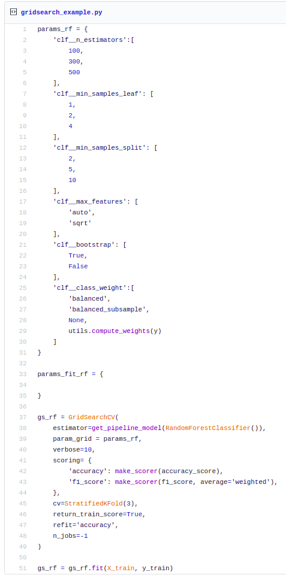
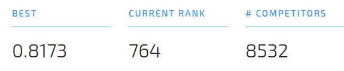
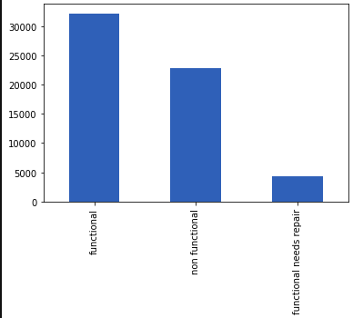

# How to solve a classification problem with a reusable pipeline workflow - 2

### 5. Tuning Hyperparameters: GridSearch
After select RandomForest model, we are going to figure out the best hyperparameters that adjust to our problem. 
As a first approach, we will use GridSearch to train whole hyperparameter grid. This task takes a long time to compute, so we will be smart to select combination of parameters. 

> Most probably in the future, we could improve this solution *pivoting* to a parallelize approach.

To train all model combinations, execute a similar code: 
<!-- [gist](https://gist.github.com/JonathanLoscalzo/71a620a9f71547ba4ef05b32e841f3c7)   -->


But, How many combinations do we have?

```
len(ParameterGrid(params_rf)) # 432 parameters!!!
```
Of course, that is a lot of time. 

As a homework, we challenge you to find the best hyperparameter combination and submit your predictions to the competition!

> Note: *scoring* parameters indicates which metric GridSearch evaluates. In the end, GridSearch select these hyperparameters and train a last model which we could use with *best_estimator_*; *refit* parameter is guilty of that behavior. Only to finish the flow, we omit that is being happen.

If you would like to see a detail of all training, you may execute the code below: 
``` pd.DataFrame(gs_rf.cv_results_) ```
Jupyter shows it in a fancy way.

### 6. Evaluate with hyperparameters
We could use hold-out or cross-validation methods for testing these hyperparameters. 

Hold out is when we split up the dataset in train-test sets (sometimes train-valid-test sets). We fit with train set, and evaluate with test set.

Cross-validation is when we split up our the dataset in k-folds. Then, we train a model with k-1 folds, and  evaluating each model with 1-fold; the process is repeted on each fold, so in the end we have k models trained.

We prefer use Hold-out rather that CV when we have a large dataset or to start building a model. CV is usually the preferred because it trains k models, and perform better on unseen data. 

To challenge CV, we stratify the train-test sets by target labels instead of randomize only. It will be a good exercise to stratify by categorical features too; *How could you do that?.* 

```
X_train, X_test, y_train, y_test = train_test_split(
    X, y, 
    test_size=0.33, 
    stratify=y # stratify by target labels
)
```

> Note: our model performs a little bit better on unseen data with *best_estimator_* over hold-out (0.0005), but remember this is only to finish de flow.

We code a method that returns metrics which we want to evaluate. Remember: If we modularize, we will also use it with other models! [print_metrics](https://github.com/JonathanLoscalzo/pump-it-up_data-mining-the-water/blob/master/pumpitup/notebooks/utils.py)

The result of execute *print_metrics* is the next summary:

```
- 0: 'functional'
- 1: 'functional needs repair'
- 2: 'non functional'

********** Metrics for: Test *************
accuracy: 0.8068054280175492
    
********** Classification Report **********
      precision    recall  f1-score   support

0       0.90      0.80      0.85     12051
1       0.29      0.63      0.40       665
2       0.77      0.84      0.80      6886
```
As we can see, *functional needs repair* is imbalanced, because the support is lower, and our model can not perform as well as over the other labels because it does not have an optimal precision. The model does not generalize over *target 1*.

The accuracy is rounded at 0.80% on unseen data (variance) and 0.95% on train set (bias); we could say that our model is also overfitted. Please see [bias-variance tradeoff](https://en.wikipedia.org/wiki/Bias%E2%80%93variance_tradeoff)

For now, we are not going to stop to fix the issue above because we would like to meet the premise "agile"!. In the next iteration we could try to solve it.

### 7. Train with whole dataset! Final Model. 

 At this moment, we fit the final model which is compose of the preprocessing pipeline and the RandomForest model, then we predict and submit the results to the competition.

```
rf_final = get_pipeline_model(RandomForestClassifier()).set_params(**rf_params,)
rf_final = rf_final.fit(X,y)
```

```
predictions = rf_final.predict(datatest)
predictions = y_transformer.inverse_transform(predictions)
now_str = datetime.now().strftime('%Y-%m-%d_%H-%M-%S')
pd.DataFrame(predictions, index=datatest.index, columns=['status_group']).to_csv(f'../data/results/results-rf-{now_str}.csv')
```

Submit the file and well-done! we obtained a good result.



______________________

## Next Iterations
### Handling imbalanced datasets
The dataset of the competition seemed rather imbalanced, and the precision on *fuctional needs repair* was not very good.



We should take the matter on own hands, or use some library with that purpose. 
See: [imbalanced-learn](https://github.com/scikit-learn-contrib/imbalanced-learn), [Post-english](https://machinelearningmastery.com/tactics-to-combat-imbalanced-classes-in-your-machine-learning-dataset/), [Post-Spanish](https://www.aprendemachinelearning.com/clasificacion-con-datos-desbalanceados/)

Also, we could try analize the parameter *class_weight* from [RandomForest](https://scikit-learn.org/stable/modules/generated/sklearn.ensemble.RandomForestClassifier.html)

### Scaling numeric data
We could treat numeric data, but in this case, the coefficients and splits of Decision Tree based models are not affected by scaling (like kmeans, PCA, Neural Networks, ...)

See: [Decision-Tree](https://www.saedsayad.com/decision_tree.htm), [information-gain](https://en.wikipedia.org/wiki/Information_gain_in_decision_trees)

### More Speed? Parallelize Approach? Dask!
There are a plenty known tools regarding to parallelize and Big Data, two of them: 
- Pyspark & MLlib: it has own algorithms and other utilities similar to sklearn (like GridSearch, Pipelines, ...). The drawback is we have to re-write whole basecode. 

- Dask: according to its web, Dask is a flexible library for parallel computing in Python.* Really, it is very interesting! It is "compatible" (non-fully compatible) with many of libraries that we usually use: pandas, sklearn.
Dask build a DAG of execution, and then execute all code parallelize in dask-clusters (as spark!) with the sentense ```compute()```. [Here](https://ml.dask.org/index.html?highlight=random%20forest#parallelize-scikit-learn-directly) they explained how to parallelize sklearn! *Who wants to try it?*

See: [pyspark-mllib](https://spark.apache.org/docs/latest/ml-guide.html), [dask](https://docs.dask.org/en/latest/), [DAG](https://en.wikipedia.org/wiki/Directed_acyclic_graph)

### Ensemble Models: mlextend
Makes the assumption that we found found a model which performs better over target *functional needs repair*. We could ensemble many models and obtain a powerful classifier. 

*mlextend* has facilities to build ensemble models.

[mlextend](http://rasbt.github.io/mlxtend/)

### Feature Engineering
More advance approach, we could try other libs and techniques for FE.

See: [tpot](https://github.com/EpistasisLab/tpot), [xverse](https://github.com/Sundar0989/XuniVerse), [category_encoders](http://contrib.scikit-learn.org/categorical-encoding/), [sklearn feature selection](https://scikit-learn.org/stable/modules/feature_selection.html)


